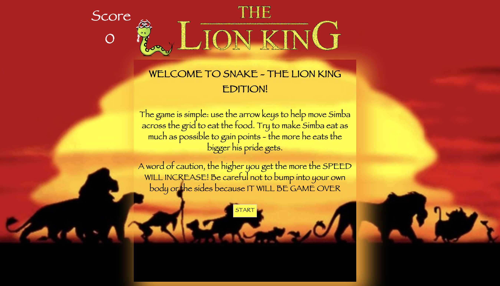
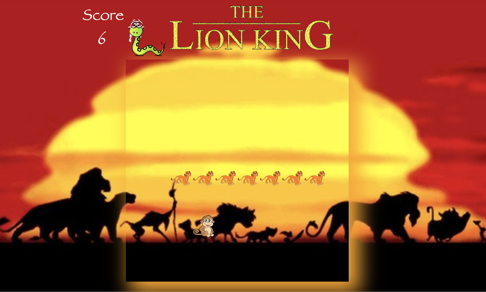
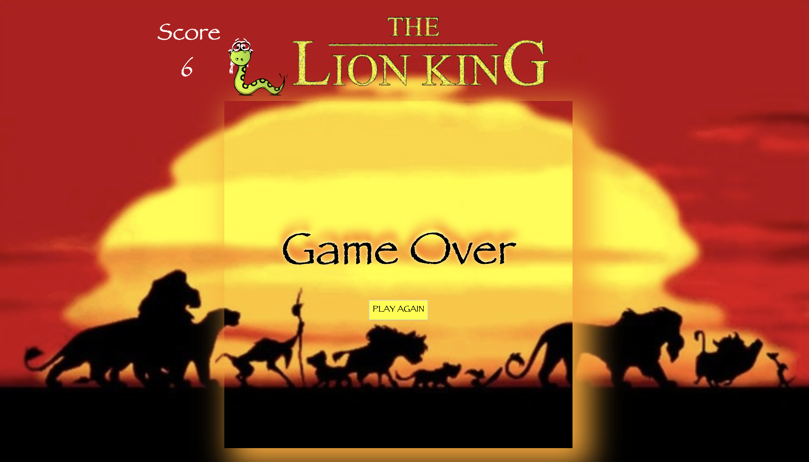

# SEI-PROJECT 1 - SNAKE, The Lion King Edition

## Goal
Snake is a classic game which most people will remember from the 90's. The aim was to create Snake within a time frame of 7 days using JavaScript. As you will see I have put my own spin on the game, and have added some fun sounds and images.

## Controls
SNAKE movements:
← ↑ → ↓ keys

Technologies Used
* JavaScript (ES6)
* CSS + CSS Animation
* HTML + HTML Audio
* Google Fonts
* GitHub

## SNAKE - walk through
It opens with the home page where you are greeted with the instructions of the game.

Once you have read the instructions you can start to play.

Try to eat as much 'food' as possible without crashing into your own body or the side of the grid.

Once it's game over you then have the option to play the game again.

## Approach
The first step of my approach was to create a basic grid of a width of 10. This was required so that the snake has a basic outline of where the limits are. The next step was to make the snake head move using the arrow keys. I found the best way to do this was to make a switch statement 
- find a way for the food to generate
- find different food
- find a way that the snake gets longer when food is food eaten
- score to go up when snake eats food

## Challenges
I found the approach on how to make the snake longer every time it eats the food. This took a few trial and errors until I found the best way was to slice

## Wins
- styling and audio really help put my own spin on the game, as it is still Snake but with a twist.
- completing the game to a high standard within a specified timeframe

## Future Features
The first thing I would would work on would be to make the game responsive to mobile devices. The next feature would be to add in a high score system where the game remembers what the highest score achieved was.

Play my snake here: https://simbrar1.github.io/SEI-project-1/
